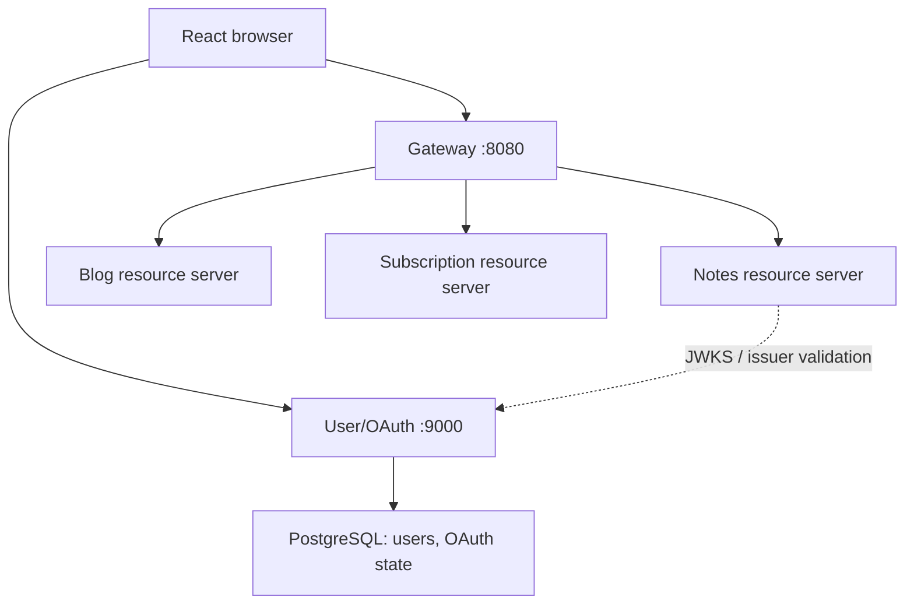

# TechNotes User/OAuth Service - Engineering Blueprint v2

**Owner:** Shakti Singh | **Date:** 29 September 2026 | **Status:** proposed handoff, not implementation proof  
**Source contract:** `TechNotes_User_OAuth_Service_Spec_v1.md` (28 Sep 2026). Product alignment: Backend Product Blueprint v2.

## 1. Responsibility and service links

This service owns account registration, identities, credentials, account roles/status, OAuth2/OIDC Authorization Server, JWT access tokens, JWKS, profile APIs, consent/authorizations and security audit. PostgreSQL is its private store. It issues identity and role/scope claims for Notes, Blog and Subscription; it does not store their notes, posts, subscriptions or payment events. Resource services validate tokens and enforce their own permissions; they do not read the identity database. API Gateway routes business APIs and forwards tokens. OAuth protocol routes must preserve the issuer and registered redirects.

Local contract: issuer `http://localhost:9000`; browser `http://localhost:5173`; Gateway `http://localhost:8080`; access-token audience `technotes-api`. Browser login uses Authorization Code + PKCE (`S256`), with OIDC where requested. ID token cannot call APIs. Proposed token lifetime: 10 minutes. Exact deployment origins, signing key lifecycle and patches must be configured and tested.

## 2. Release slices

| Stage | Scope | Exit condition |
|---|---|---|
| B0 | App, Java 21/Maven, Flyway migrations, persistent signing key, health, test config | Fresh clone and restart retain identity/issuer state |
| M1 | Controlled registration, profile, client registration, OAuth code+PKCE, consent, JWT/JWKS, roles/scopes | Two authors and reader get correct tokens; Gateway to Notes works |
| M2 | Admin role/status, password change/reset, email verification, persistent browser session where needed | Privilege and recovery behavior tested |
| M3 | Reviewed confidential clients/BFF option, service identities, revocation/introspection and notifications | Separate security design approved |

Public signup initially grants only `READER`. Curated `AUTHOR`, `REVIEWER`, `ADMIN` provisioning is controlled; Blog Service separately permits an authenticated READER to author **own community post drafts**. An active Premium subscription is not an OAuth role. Subscription/Billing owns entitlement and its API; do not bake long-lived Premium claims into JWTs.

## 3. Code architecture and classes

Suggested root `com.technotes.identity`: `config`, `security`, `oauth`, `user`, `admin`, `recovery`, `audit`, `common.error`, `common.validation`. Suggested concrete classes, subject to chosen Spring Authorization Server APIs:

| Package | Class / interface | Responsibility |
|---|---|---|
| `config` | `AuthorizationServerConfig`, `SecurityFilterChainConfig`, `CorsConfig` | Protocol, API and browser chains; issuer/CORS/CSRF policy |
| `oauth` | `RegisteredClientConfiguration`, `JwtTokenCustomizer`, `JwkSourceConfiguration` | Persist clients; emit audience/scope/roles; stable signing key and JWKS |
| `user.document` or `user.entity` | `UserEntity`, `RoleEntity`, `UserRoleEntity` | JPA user model; unique normalized email, version, status |
| `user.repository` | `UserRepository`, `RoleRepository` | Scoped persistence methods |
| `user.service` | `RegistrationService`, `CurrentUserService`, `PasswordPolicyService` | Account creation, self-profile and hashing policy |
| `user.controller` | `RegistrationController`, `CurrentUserController` | Business REST APIs only |
| `user.dto` | `RegisterUserRequest`, `PatchMeRequest`, `UserResponse` | No password hashes or server-managed role/status in request |
| `admin` | `UserAdministrationController`, `UserAdministrationService`, role/status DTOs | Audited M2 privilege and state changes |
| `recovery` | `PasswordRecoveryService`, `EmailVerificationService`, proof DTOs | M2 one-time proof workflows |
| `audit` | `SecurityAuditService`, `SecurityAuditEventEntity` | Actor, target, action/outcome/trace; no secrets |
| `common.error` | `ApiExceptionHandler`, `ApiErrorResponse` | Shared business error envelope |

Use JPA for business user tables. Spring Authorization Server JDBC implementations own protocol tables; apply the exact selected-version schema via reviewed Flyway migration, rather than inventing their internals. Persist signing keys outside Git in a stable keystore/managed secret. Restart must not change issuer signing identity.

## 4. Data model and dependencies

| Table/store | Key constraints and purpose |
|---|---|
| `users` | UUID PK, unique normalized email, display name, password hash, ACTIVE/LOCKED/DISABLED, email_verified, `version`, timestamps |
| `roles` / `user_roles` | Fixed role codes and unique user-role association; no signup self-promotion |
| `oauth2_registered_client` | Exact redirects/grants/scopes, public PKCE client |
| `oauth2_authorization`, `oauth2_authorization_consent` | Durable code/token/consent protocol state |
| `security_audit_events` | Role/status/password and security events, trace ID, no credentials |
| `account_action_tokens` (M2) | Hashed one-time proof, purpose, expiry and consumedAt |
| Shared session store (M2) | Session survival/invalidation across instances where required |

Dependencies: Java 21, Maven Wrapper, pinned compatible Spring Boot/Security/Authorization Server, Spring Web, Spring Security, OAuth2 Authorization Server, OAuth2 Resource Server for own business APIs, Data JPA, JDBC, PostgreSQL driver, Flyway, Validation, Actuator, JUnit, Testcontainers. Align framework versions with the 28 Sep spec; verify exact current versions in the repo rather than treating target families as installed.

## 5. Identity, roles and scopes

Representative access token: `iss`, immutable UUID `sub`, `aud=["technotes-api"]`, `jti`, space-separated `scope`, `roles` string array, `iat`, `nbf`, `exp`. Role-to-scope ceilings are defined in the v1 identity spec and must be applied at issuance. Notes uses `notes.read`, `notes.write`, `notes.review`, `taxonomy.write`; profile APIs use `profile.read`/`profile.write`; admin APIs use `users.manage`. Blog scopes and service registration are a **new cross-team contract**, not already granted by existing tokens. Suggested `blogs.read`, `blogs.write`, `blogs.review` require review with Blog owner. A role does not override missing scope.

For browser flows configure three ordered chains: authorization-server protocol endpoints; stateless bearer `/api/v1/users/**`; session login/consent/logout with CSRF. Do not globally disable CSRF. Register exact local redirect `http://localhost:5173/auth/callback`. CORS permits only reviewed origins and endpoints; it is not authentication. Validate `aud`, `iss`, time and signature on own bearer APIs as well.

## 6. Endpoints and DTOs

**Framework-owned protocol**: `GET /oauth2/authorize`, `POST /oauth2/token`, `GET /oauth2/jwks`, OAuth and OIDC well-known discovery, `GET /userinfo`, browser `GET/POST /login`, `POST /logout`. These are not home-written JSON controllers. Revocation/introspection and RP logout are later-stage as stated in the identity spec.

| Stage | Business route | Actor / scope | DTO / response |
|---|---|---|---|
| M1 | POST `/api/v1/users/register` | Anonymous, rate-limited | `RegisterUserRequest` → 201 `UserResponse` |
| M1 | GET `/api/v1/users/me` | Bearer + `profile.read` | 200 `UserResponse`, ETag |
| M1 | PATCH `/api/v1/users/me` | Bearer + `profile.write`, If-Match | `PatchMeRequest` → 200 updated response |
| M2 | GET `/api/v1/users` / `/{id}` | ADMIN + `users.manage` | Bounded page / user DTO |
| M2 | PUT `/api/v1/users/{id}/roles` | ADMIN + users.manage, If-Match | Replace role set, audit |
| M2 | PATCH `/api/v1/users/{id}/status` | ADMIN + users.manage, If-Match | State and reason, audit |
| M2 | POST `/api/v1/users/me/password` | Authenticated + profile.write | Current/new password → 204 |
| M2 | POST `/api/v1/users/password-reset-requests` / `password-resets` | Anonymous with proof | Generic 202 / 204 |
| M2 | POST `/api/v1/users/email-verification-requests` / `email-verifications` | Anonymous with proof | Generic 202 / 204 |

`RegisterUserRequest`: `email`, `displayName`, `password`; normalize email; validate format/length/password policy; never accept role, status or verified flag. `UserResponse`: ID, email, displayName, roles, status, emailVerified, version, timestamps; no hash, token or security proof. `PatchMeRequest`: `displayName` only; changing email requires verified-email workflow. Existing-record mutation requires `If-Match: "user-<uuid>-v<version>"`; missing 428, stale 412. M2 role request replaces full role set; protect last active ADMIN with transactional concurrency. Status change requires reason. Recovery request returns identical generic acknowledgement for unknown account; hashed, expiring proof is consumed atomically once. Error envelope matches Notes: `timestamp,status,code,message,path,traceId,fieldErrors` for business APIs; OAuth protocol endpoints use standard protocol errors.

## 7. Cross-service journeys

1. Registration persists `READER` account and password hash; does not invent a JWT in registration response.
2. Browser redirects to issuer with registered client, exact redirect, state, nonce (OIDC) and PKCE challenge; issuer authenticates and grants requested permitted scopes; callback exchanges code with verifier.
3. Browser calls Gateway with access token. Notes/Blog each validate JWT and roles/scopes/ownership. Notes saves `authorId=sub`; Blog saves post author similarly.
4. Subscription checkout is handled by Subscription/Billing, which checks identity and owns entitlement. Identity token alone never proves payment.
5. Disabling user or changing roles blocks new issuance/identity-service administration promptly, but a previously issued offline JWT can remain valid until expiry. Document the bounded window; stronger immediate enforcement needs a separately designed online check.

## 8. Security, testing and operational gate

Hash passwords with reviewed adaptive encoding; no plaintext credentials, signing keys or provider secrets in Git/logs. Rate-limit signup/login/recovery and use generic recovery responses. Key rotation retains old public keys until issued tokens plus skew expire. Persist clients/authorizations/consent; test restart. Account admin operations audit actor, target, prior/new state and reason. Include backup/migrations, HTTPS, secure cookie attributes, CORS, trusted proxy and CSRF review before public release.

Acceptance: Flyway on empty DB and upgrade; identical password produces distinct salted hashes; duplicate normalized email race; code+PKCE success and wrong verifier/reused code failure; exact issuer/audience/roles/scopes; JWKS contains public material only; restart stable signing key; ID token rejected by Notes; two author identities isolated through Gateway; unauthorized role/scope tests; M2 last-admin race, one-time reset proof replay, disabled account issuance behavior and token expiry window.

## 9. Build order and decisions

B0 PostgreSQL/Flyway + stable key → M1 user/role model and controlled registration → registered client/code+PKCE/JWKS/token claims → profile APIs → real-token Notes integration → Blog role/scope contract → M2 account operations. One Jira ticket/feature branch/PR into develop; verify current Jira state before creating branches.

Decisions: exact pinned versions; production issuer/origins; signup/email-verification policy; blog scopes and reviewer mapping; browser token storage/BFF decision; session strategy; key rotation; email provider; rate limits; account disable consistency. The newer product blueprint's Premium and Blog requirements extend, but do not silently rewrite, the v1 issuer contract.
