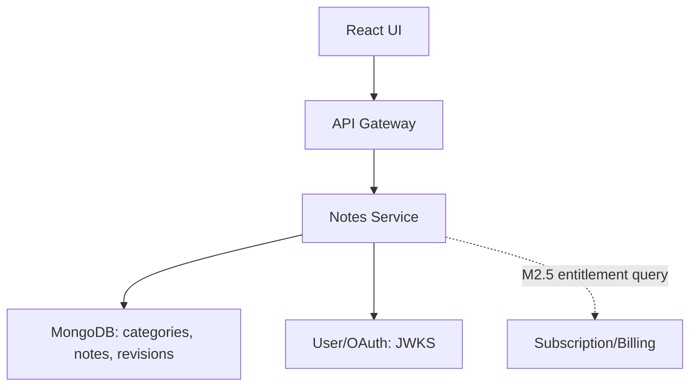
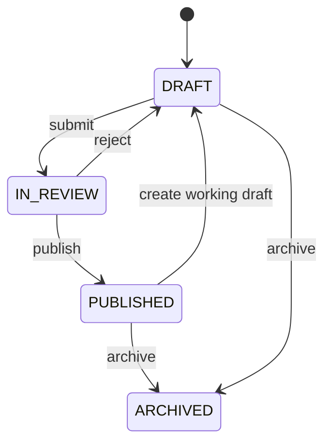

# TechNotes Notes Service — Engineering Blueprint v2

**Date:** 29 September 2026  
**Audience:** Notes developer, API/UI developer, reviewer, product owner  
**Status:** Implementation handoff proposal. Existing v1 Notes spec controls M1/M2 contracts until a reviewed change is approved. This document does not certify repository code.

## 1. Product responsibility and boundary

Notes Service owns the **official curated learning library**: the recursive subject/category tree, Markdown notes, draft ownership, editorial review, immutable published versions and public reading. Example path: Java → Core Java → Collections → ArrayList → “ArrayList internals”. It will later support structured interview Q&A and access tiers, after separate versioned contracts. A learner sees Java/DSA lessons with code examples; authors write and reviewers publish them.

It does **not** own accounts/passwords/tokens (User/OAuth), user-generated community blogs (Blog Service), plans/payments/entitlement truth (Subscription/Billing), binary files (future Media Service), full-text ranking (future Search), or Gateway routing. No direct cross-service database reads. `authorId` is taken from verified JWT `sub`.

### Delivery boundary

| Stage | In Notes | Product outcome |
|---|---|---|
| B0 / current ticket baseline | Build, configuration, health, Mongo connectivity, reproducible tests | Stable runnable service |
| M1 / private authoring | Recursive categories and secure CRUD for `NOTE` drafts | Authors can prepare official content; no anonymous note body |
| M2 / publication | Submit, reject, publish, archive, revisions, public APIs | Published PUBLIC notes available to visitors |
| M2.5 / tiered reading | `PUBLIC`, `FREE_ACCOUNT`, `PREMIUM` policy and entitlement integration | Free account and subscriber access without leakage |
| M3 / content extension | Interview Q&A, media references, search events | Interview preparation and richer content |

The newer 28 Sep Notes spec supersedes older split topic/category drafts for new implementation: **one recursive `categories` collection**; “topic” and “subcategory” are UI labels. A separate `/topics` API, `topics` collection and Topic Service are excluded from v1. Older technical design must be explicitly reconciled in review rather than silently combined.

## 2. Architecture and request path



The issuer signs tokens; Notes validates locally via JWKS, checks issuer `http://localhost:9000`, audience `technotes-api`, signature/algorithm, `nbf` and `exp`. Gateway forwards the bearer token; Notes enforces role, scope and ownership itself. Local Gateway is `http://localhost:8080`, Notes direct port 8081. Container networking must preserve the exact issuer expectation.

Feature-oriented packages: `config`, `security`, `category/{controller,dto,document,repository,service}`, `note/{...}`, `revision/{...}` (M2), `publication/{...}` (M2), `access/{...}` (M2.5), `common/{error,validation,pagination}`. Controller parses HTTP; service enforces invariants and transactions; repository expresses filtered queries; mapper converts documents to DTOs. Never return Mongo documents directly.

### Dependencies and deployment

Java 21, Maven Wrapper, Spring Boot 3.5.x target, compatible Spring Cloud 2025.0.x target, Spring MVC, Spring Data MongoDB, Validation, OAuth2 Resource Server, Actuator, JUnit and Testcontainers. Pin verified patches in the baseline PR; the target family is not a pinned build. MongoDB host `27018` → container `27017`, database `technotes_notes_db`. M2 atomic publication needs a Mongo replica set, including integration tests. Use external secrets and environment-specific configuration. The local setup does not require Kafka, Elasticsearch or Kubernetes.

## 3. MongoDB data model and indexes

### `categories` (M1)

| Field | Type / origin | Constraint |
|---|---|---|
| `_id` | UUID string / server | Opaque public `id` |
| `name` | String / client | Trimmed 1–100 |
| `slug` | String / create request | Lowercase ASCII 1–100, immutable |
| `parentId` | UUID string or null / client | Null at root; immutable v1 |
| `ancestorIds` | UUID list / server | Root-to-parent order |
| `level` | Integer / server | Root 1, proposed max 8 |
| `description` | String or null / client | At most 1,000 |
| `active` | Boolean / server | Default true; inactive ancestor makes subtree ineffective |
| `sortOrder` | Integer / client | 0–100000, default 0 |
| `version`, audit | Long, timestamps, actor IDs / server | Optimistic concurrency and auditing |

Unique `{parentId:1,slug:1}` and listing `{parentId:1,active:1,sortOrder:1,_id:1}`. Normalize root parent to null. Validate parent existence, active ancestor chain, maximum depth, duplicate sibling slug. Reparenting/deletion excluded. Reject deactivation of a subtree with live public publication until affected content is archived or recategorized. Index creation is controlled and tested.

### `notes` (M1, expanded M2)

| Field | Type / origin | Constraint |
|---|---|---|
| `_id` | UUID string / server | Public `id` |
| `title` | String / client | Trimmed 1–200 |
| `slug` | String / server | Stable title slug + ID suffix; unique and immutable |
| `summary` | String or null / client | At most 500 |
| `contentMarkdown` | String / client | Nonblank, at most 1 MiB UTF-8 |
| `primaryCategoryId` | UUID string / client | Existing effective active category |
| `tags` | String list / client | Up to 10 distinct lowercase slugs, 1–40 each |
| `contentKind` | Enum / server | `NOTE` only in M1 |
| `authorId` | UUID string / JWT `sub` | Immutable; never client supplied |
| `status` | Enum / server | M1 `DRAFT`; M2 workflow below |
| `visibility` | Enum / request | `PRIVATE` default, `PUBLIC` allowed; still hidden until published |
| `publishedRevisionId`, published projection | Server / M2 | Only committed snapshot is publicly readable |
| `version`, `deletedAt`, audit | Server | Lock, soft delete and timestamps |

Indexes: unique `{slug:1}` and owner list `{authorId:1,deletedAt:1,status:1,updatedAt:-1,_id:-1}`. Add public/category indexes for actual M2 read queries after checking plans. Deleted slugs are never reused. Field name is **`primaryCategoryId`**, not legacy `categoryId`; IDs are UUID strings, not Mongo ObjectIds.

### `note_revisions` (M2)

Immutable publication snapshots with `revisionId`, `noteId`, `revisionNumber`, title, slug, summary, Markdown, category, tags, visibility, author/reviewer IDs, `publishedAt`. Unique `{noteId:1,revisionNumber:1}`. Published pointer and snapshot update in one Mongo transaction. Keep old published snapshot visible when a new working draft is created. Revision history must not be rewritten by draft edits.

### M2.5 content access migration

The current `visibility` field means PRIVATE/PUBLIC. It cannot be quietly redefined as a three-tier paywall. Add a reviewed `accessTier` (`PUBLIC`, `FREE_ACCOUNT`, `PREMIUM`) to published snapshots and a suitable public listing projection. Decide how PRIVATE publication maps, migrate existing records and version API DTOs. A public metadata card may show a restricted title/summary only when editorially allowed; body/answer text must not be sent. Entitlement truth remains in Subscription/Billing. Cache keys must include audience/identity policy; do not share a Premium body via public CDN cache.

## 4. DTO catalogue and validation

DTOs below are **M1/M2 v1 contract** unless marked future. Request DTOs allow only caller-editable fields; reject unknown fields and server-owned `id`, `authorId`, `status`, `contentKind`, timestamps, `version`, `publishedRevisionId`. Validate at HTTP boundary **and** enforce domain invariants in service logic.

| DTO | Fields | Rules / use |
|---|---|---|
| `CreateCategoryRequest` | `name`, `slug`, `parentId`, `description`, `sortOrder` | `name` 1–100; slug `[a-z0-9]+(?:-[a-z0-9]+)*`; nullable parent; description ≤1000; sort 0–100000. |
| `PatchCategoryRequest` | `name?`, `description?`, `active?`, `sortOrder?` | Partial update; omitted unchanged; only description may be null to clear. No slug/parent move. |
| `CategoryResponse` | `id`, `name`, `slug`, `parentId`, `ancestorIds`, `level`, `description`, `active`, `sortOrder`, `version`, `createdAt`, `updatedAt` | Server-provided canonical category. |
| `CreateNoteRequest` | `title`, `summary`, `contentMarkdown`, `primaryCategoryId`, `tags`, `visibility` | Required title/content/category; optional summary/tags; default PRIVATE. No client-owned author/status. |
| `PatchNoteRequest` | `title?`, `summary?`, `contentMarkdown?`, `primaryCategoryId?`, `tags?`, `visibility?` | Omitted unchanged; null only clears summary; empty tags clears tags; edit working draft only; requires `If-Match`. |
| `NoteResponse` | `id`, `title`, `slug`, `summary`, `contentMarkdown`, `primaryCategoryId`, `tags`, `contentKind`, `authorId`, `status`, `visibility`, `version`, `createdAt`, `updatedAt` | Protected editable detail; response ETag. |
| `NoteListItemResponse` | `id`, `title`, `slug`, `summary`, `primaryCategoryId`, `tags`, `status`, `visibility`, `version`, `updatedAt` | No Markdown; list is owner/reviewer/admin filtered at query. |
| `PageResponse<T>` | `items`, `page`, `size`, `totalElements`, `totalPages` | Zero-based page, size default 20/max 100. |
| `RejectNoteRequest` | `reason` | M2 required 1–1000; recorded in audit. |
| `ArchiveNoteRequest` | `reason` | M2 optional ≤1000. |
| `RevisionSummaryResponse` | `revisionId`, `revisionNumber`, `publishedAt` | M2 paginated metadata, authorized access. |
| `RevisionDetailResponse` | Snapshot fields, `revisionId`, `revisionNumber`, `publishedAt` | M2 authorized historical snapshot. |
| `PublicNoteCardResponse` | `slug`, `title`, `summary`, `primaryCategoryId`, `tags`, `publishedAt` | M2 published PUBLIC only; no body. |
| `PublicNoteDetailResponse` | Published title, slug, summary, Markdown, category, tags, `revisionNumber`, `publishedAt` | M2 no internal reviewer/security fields; never working draft. |
| `ContentCardResponse` / `ReaderResponse` | Published metadata, access tier, permitted preview/body | **M2.5 proposal**; define exact versioned schema and 401/403 semantics before coding. |
| `InterviewQuestionRequest/Response` | Question, answer, topic, difficulty, examples | **M3 proposal**; separate contract, not accepted by M1 create note. |

### Representative request/response

`POST /api/v1/notes` with `Authorization: Bearer <access_token>`:

```json
{
  "title": "ArrayList internals",
  "summary": "Capacity, resizing and iteration",
  "contentMarkdown": "# ArrayList\n\n```java\nList<String> items = new ArrayList<>();\n```",
  "primaryCategoryId": "6c4d7658-82e1-494f-b333-3d0b063cb5d2",
  "tags": ["java", "collections"],
  "visibility": "PRIVATE"
}
```

Returns `201`, `Location: /api/v1/notes/{id}`, `ETag: "note-{id}-v0"` and a `NoteResponse` with server-created `id`, `slug`, `authorId`, `contentKind=NOTE`, `status=DRAFT`, `version=0`, timestamps. Client cannot select `PREMIUM` or `INTERVIEW_QUESTION` in this v1 request.

### DTO documentation template for each endpoint

Record: method/path/stage; actor, role and scope; request headers; path/query params and defaults; JSON request field table with type, required/default, length/range/null behavior and example; response status/headers/body; sorting/pagination; error mapping; privacy constraints; two positive and two negative examples; version/compatibility notes. Publish OpenAPI examples generated/reviewed against real controller behavior and link the DTO catalogue from the service README.

## 5. Endpoint catalogue

**Protected M1** (all require valid access token):

| Method / path | Purpose | Authorization | Result |
|---|---|---|---|
| POST `/api/v1/categories` | Create node | ADMIN + `taxonomy.write` | 201, CategoryResponse, Location/ETag |
| GET `/api/v1/categories` | Paginated flat/children/root list | AUTHOR/REVIEWER/ADMIN + `notes.read` | 200 page |
| GET `/api/v1/categories/{id}` | Node detail | Same | 200 CategoryResponse |
| PATCH `/api/v1/categories/{id}` | Name/description/active/order | ADMIN + `taxonomy.write` + If-Match | 200 + ETag |
| POST `/api/v1/notes` | Create own draft | AUTHOR/ADMIN + `notes.write` | 201 NoteResponse |
| GET `/api/v1/notes` | Scoped list | AUTHOR/REVIEWER/ADMIN + `notes.read`; view rule | 200 page |
| GET `/api/v1/notes/{id}` | Editable detail | Owner/ADMIN + `notes.read` | 200 + ETag |
| PATCH `/api/v1/notes/{id}` | Edit own draft | Owner/ADMIN + `notes.write` + If-Match | 200 + ETag |
| DELETE `/api/v1/notes/{id}` | Soft-delete unpublished draft | Owner/ADMIN + `notes.write` + If-Match | 204 |

**Editorial/public M2:**

| Method / path | Purpose | Rule |
|---|---|---|
| POST `/api/v1/notes/{id}/submit` | DRAFT → IN_REVIEW | Owner/ADMIN + notes.write + If-Match |
| POST `/api/v1/notes/{id}/reject` | IN_REVIEW → DRAFT, reason | REVIEWER/ADMIN + notes.review + If-Match |
| POST `/api/v1/notes/{id}/publish` | IN_REVIEW → PUBLISHED, snapshot | REVIEWER/ADMIN + notes.review + If-Match; no reviewer self-approval |
| POST `/api/v1/notes/{id}/draft` | PUBLISHED → editable DRAFT | Owner/ADMIN + notes.write + If-Match; existing publication stays live |
| POST `/api/v1/notes/{id}/archive` | Remove from normal public reads | Owner/ADMIN + notes.write + If-Match |
| GET `/api/v1/notes/{id}/revisions` | Revision metadata | Owner/ADMIN or assigned reviewer context + notes.read |
| GET `/api/v1/notes/{id}/revisions/{revisionId}` | Historical snapshot | Same restricted rule |
| GET `/api/v1/public/categories` | Effective active nodes | Anonymous |
| GET `/api/v1/public/notes` | Published PUBLIC cards | Anonymous |
| GET `/api/v1/public/notes/{slug}` | Published PUBLIC detail | Anonymous |

M2.5 adds versioned tier-aware listing/reader contracts after entitlement design. Do not make v1 anonymous route return a paid body. Do not add free-form status PATCH. Admin-only inactive category query, root/parent selectors, exact category/tag note filters and allowed sort fields follow the existing Notes spec.

### Common HTTP conventions

JSON UTC ISO-8601 timestamps and opaque UUID strings. List `page=0`, `size=20` (max 100), stable ID tie-break. Notes sort: `updatedAt` or `createdAt`; public sort: `publishedAt`, ascending/descending as documented. Unknown filters/sorts rejected. Existing resource mutation needs ETag/`If-Match`: missing → 428, stale → 412, atomic version check. PATCH is a partial object, not JSON Patch. Unknown/server-owned input → 400. Max proposed request JSON 2 MiB; oversized → 413. Create is not implicitly idempotent, so client must not blindly retry an ambiguous response.

```json
{
  "timestamp": "2026-09-29T00:00:00Z",
  "status": 400,
  "code": "VALIDATION_FAILED",
  "message": "Request validation failed",
  "path": "/api/v1/notes",
  "traceId": "example-trace-id",
  "fieldErrors": [{"field": "title", "message": "must not be blank"}]
}
```

Relevant errors: 400 validation; 401 missing/invalid bearer; 403 valid identity but insufficient role/scope; 404 unknown/inaccessible private note; 409 duplicate slug, category in use or invalid transition; 412 stale version; 413 oversized; 428 precondition required; 429 rate limit; 503 dependency unavailable. Never leak stack traces, JWTs, passwords, Mongo details or private body in errors.

## 6. Workflow and invariants



M1 supports DRAFT only. In M2, submission validates active category and required content; IN_REVIEW text is locked until rejection. Publishing atomically creates snapshot plus pointer/projection; a reviewer cannot approve own content, ADMIN exception is explicit and audited. PUBLISHED → DRAFT starts a new working copy while old snapshot remains public; on later approval it becomes the new snapshot. ARCHIVED disappears from normal public list/detail; restore is deferred. Draft soft delete allowed only with no published revision. All transitions require `If-Match` and increment version. Tests must cover simultaneous reviewers and concurrent edits.

### Future tier decision, including failure behavior

1. Resolve only an eligible published snapshot.
2. `PUBLIC`: anonymous allowed. `FREE_ACCOUNT`: validated user required. `PREMIUM`: validated user + current entitlement decision required.
3. If entitlement cannot be established, do not send Premium body; provide a retryable safe response.
4. Ensure search snippets, card previews, generated metadata, media references and cache layers follow the same policy.
5. Entitlement cache duration, event invalidation, expiry and downgrade behavior need an agreed contract with Billing before deployment.

## 7. Security, rendering and privacy

Map token `scope` to `SCOPE_*` and `roles` to `ROLE_*`; require both per endpoint. `READER` has no authoring rights; reviewer may read assigned in-review content but cannot edit somebody else's text. Query private notes with owner restrictions in Mongo repository/service predicates, never load broad pages and filter afterward. Foreign private note returns 404. Do not trust `X-User-Id`, `X-Roles`, body `authorId`, or Gateway origin as identity. ID tokens cannot call APIs. Public paths must project the immutable published copy only.

Markdown is stored as text. Frontend renders with HTML sanitization and code highlighting; no arbitrary scripts. No binary upload in M1/M2. In future, Media Service validates file type/size/ownership and returns attachment IDs; Notes stores references after association checks. Avoid unrestricted external image/link injection. Do not log note bodies or tokens.

## 8. Repository, configuration and operations

Expected files: Maven Wrapper, README, OpenAPI/DTO examples, `application.yml`, `application-local.yml`, test profile, `.env.example` placeholders and documented Docker Compose. Suggested environment variables: `SERVER_PORT=8081`, `MONGODB_URI=mongodb://localhost:27018/technotes_notes_db`, `OAUTH_ISSUER_URI=http://localhost:9000`, `OAUTH_JWK_SET_URI=http://localhost:9000/oauth2/jwks`, `OAUTH_AUDIENCE=technotes-api`, `EUREKA_URL=http://localhost:8761/eureka/`, `CONFIG_SERVER_URL=http://localhost:8888`. Bind them explicitly in Spring; do not assume these exact names work without configuration.

Health/readiness covers real DB connectivity. Structured logs include trace ID, request path, latency, outcome and safe IDs. Metrics cover latency/errors, auth denials, Mongo health and publication failures. Back up and restore Mongo before production claims. M2 replica set and transaction failure behavior must be demonstrated. Later event publication uses a reliable outbox, not an untracked in-memory publish. Search index is rebuildable from authoritative published snapshots.

## 9. Verification and ticket sequence

| Gate | Evidence |
|---|---|
| Baseline | Fresh clone, Java 21 Maven Wrapper build, pinned dependency compatibility, health and README. |
| Mongo/category | Testcontainers persistence, unique indexes, parent/root/depth, inactive ancestors and duplicate sibling slugs. |
| Draft notes | DTO validation, create/read/list/edit/delete, ETag 428/412, soft delete, no server-field injection. |
| Identity | Real issuer token via Gateway; author A cannot read/edit B's draft; invalid issuer/audience/signature/expiry and ID token rejected. |
| Editorial | Concurrency, reviewer self-approval restriction, immutable revision, draft-after-publication, archive privacy, replica-set transaction failure. |
| Tiered access | Anonymous/free/active/expired subscription matrix for list and detail, dependency outage, no body in preview/cache/search. |
| UI integration | Category tree, note reader, author editor and review queue use documented DTOs and errors. |

The existing developer handoff names Jira TEC-9 (baseline), TEC-10 (Mongo), TEC-11 (category), TEC-12 (note domain) and repository `techshakti55/technotes-notes-service`. Treat its dated Jira/repository snapshot as context; verify current status before working. One actual ticket → feature branch from latest develop → focused PR → test evidence. No unreviewed local experimental files or force reset.

## 10. Open decisions before extending v1

| Decision | Owner/review |
|---|---|
| Confirm recursive categories and mark old separate topic schema obsolete | Notes + UI leads |
| Tier field, migration of visibility, preview DTO and route versioning | Notes + product + UI |
| How/when Billing answers Premium entitlement; outage and cache semantics | Notes + Billing/security |
| Interview Q&A schema and whether it remains curated content in Notes | Product + Notes + UI |
| Search event/outbox contract and index permissions | Notes + Search |
| Content policy and sample Java/DSA taxonomy, access-tier allocation | Product/editorial |

## 11. Source authority

1. `TechNotes_Notes_Service_Spec_v1.md` (28 Sep 2026): authoritative *proposed* M1/M2 Notes contract.
2. `TechNotes_User_OAuth_Service_Spec_v1.md` (28 Sep 2026): issuer, claims, role and scope integration.
3. `TechNotes_Notes_Service_Developer_Handoff_v1.docx`: dated baseline, DTO and ticket handoff.
4. `TechNotes_Backend_Product_Blueprint_v2.md` and `TechNotes_UI_Product_Blueprint_v1.md`: product-wide new tier, blog and interface direction from owner discussion (29 Sep 2026).

**Change rule:** API paths, fields, policy and phase labels in this blueprint are reviewable design. Before coding M2.5/M3, publish a versioned contract with example JSON, compatibility/migration plan and acceptance tests; do not interpret future descriptions as existing API support.
