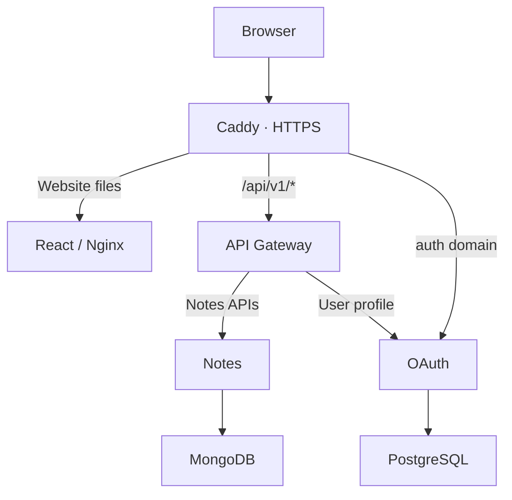

# TechNotes — AWS Deployment Complete Guide

**Owner:** Shakti Singh  
**Record date:** 2 October 2026, India time  
**Language:** Simple Hinglish  
**Purpose:** AWS ko samajhna, first-live setup ko explain karna, aur next time bina confusion ke operate karna.

> Yeh document ek learning guide aur actual deployment record dono hai. Puri file ki commands ek saath mat chalao. “One-time setup” sirf new server ke liye hai; “Daily check” running production ke liye hai. Exact AMI ID, EBS volume type, complete IAM-user policy aur har console setting ka export available nahi hai. Unhe guessed values se fill nahi kiya gaya.

## Kaise padhna hai

Pehli baar sections 1–8 se basic concepts samjho. Actual setup sections 9–21 mein hai. Issues aur backups sections 22–28 mein hain. Aage ki release aur pending work sections 29–32 mein hain.

Har command block ke pehle terminal bataya hai:

| Label | Kahan chalana hai | Prompt ka example |
|---|---|---|
| Windows PowerShell | Apne laptop par | `PS D:\TechNotes\...>` |
| Ubuntu AWS terminal | EC2 Instance Connect ke browser terminal mein | `ubuntu@ip-172-31-4-208:~$` |
| AWS Console | Browser ka AWS dashboard | Koi shell command nahi |
| GoDaddy Console | Domain ke DNS records page par | Koi shell command nahi |

Prompt ko copy mat karo. Sirf command copy karo. Windows ki `D:\...` path Ubuntu mein nahi chalegi; Ubuntu ki `/home/ubuntu/...` path Windows mein nahi chalegi.

## 1. Humne aakhir banaya kya?

TechNotes ek website hai jahan visitor bina login ke published notes padh sakta hai. Admin OAuth login karke category aur note create karta hai. Note pehle draft hota hai, phir review state mein jata hai, phir publish hota hai. Public reader ko published version milta hai.

Humne Java backend ki teen services, React UI, reverse proxy aur dono databases ek AWS EC2 server par Docker containers mein chalaye.

| Component | Seedha kaam |
|---|---|
| React UI / Nginx | Website ki screens aur static frontend files serve karta hai |
| API Gateway | `/api/v1/...` request ko sahi backend service tak bhejta hai |
| OAuth service | Admin login, authorization code, tokens aur public signing keys |
| Notes service | Categories, drafts, edits, submit, publish aur public notes |
| PostgreSQL | OAuth users, roles, clients aur authorization data |
| MongoDB | Categories, notes aur published revisions |
| Caddy | Public HTTPS entry point; domain ke hisaab se request route karta hai |
| S3 | Server se alag jagah database backup files rakhta hai |

Yeh first-live single-server deployment hai. Ismein abhi load balancer, multiple EC2 replicas ya managed database nahi hai. Ek server fail hua to website temporarily unavailable ho sakti hai.

## 2. Website se database tak request kaise jati hai?



**Example: visitor note padh raha hai.** Browser website files leta hai. UI public-notes API call karta hai. Caddy API request Gateway ko bhejta hai. Gateway Notes ko bhejta hai. Notes MongoDB se published content nikalta hai. Response wapas browser tak aata hai.

**Example: admin login.** Browser `auth.technotes.co.in` par jata hai. OAuth login complete karta hai. UI callback mein code leta hai aur PKCE verifier ke saath token exchange karta hai. Protected API call mein access token bhejta hai. Databases browser ke direct contact mein nahi hain.

## 3. Current setup ka record

| Item | Recorded value |
|---|---|
| Website | `https://technotes.co.in` |
| Authorization server | `https://auth.technotes.co.in` |
| AWS region | Mumbai — `ap-south-1` |
| Availability zone | `ap-south-1b` |
| EC2 instance | `i-07284b353e2fae538` |
| Instance type | `t3.small` |
| Server OS | Ubuntu 24.04.4 LTS, x86_64 |
| Observed memory | About 1.9 GiB usable RAM |
| Swap | 2 GiB |
| Root filesystem | About 19 GiB shown by `df`; exact EBS type not recorded |
| Private IP | `172.31.4.208` |
| Current public Elastic IP | `43.205.62.80` |
| Earlier public IP | `52.66.243.132` — historical, do not use now |
| Runtime directory | `/home/ubuntu/technotes-deployment` |
| Compose project | `technotes-production` |
| Backup bucket | `technotes-deploy-20261002-shakti` |
| Backup prefix | `production-backups/` |
| EC2 backup role | `TechNotesProductionBackupRole` |
| Role permissions policy | `TechNotesProductionBackupAccess` |

IP aur instance identifiers passwords nahi hain. Database passwords, private keys, admin password aur signed download URLs is guide mein nahi hain.

## 4. AMI kya hai? Ubuntu kyun liya?

AMI ka full name **Amazon Machine Image** hai. Yeh EC2 ka starting operating-system template hai. Instance launch karte waqt AMI choose karna padta hai. Humne Ubuntu Linux choose kiya; server par Ubuntu 24.04.4 LTS output verify hua.

Simple example: blank laptop par OS install karne ki jagah AWS prepared OS template se virtual machine start karta hai.

**Hamare liye Ubuntu ka reason:** Linux Docker deployment ke liye familiar commands, official Docker installation guidance, aur Windows desktop GUI ki requirement na hona. LTS ka matlab long-term support release. Yeh project decision hai; Ubuntu hi har project ka mandatory option nahi hai.

**Architecture bhi match honi chahiye:** humne amd64 images banayi aur x86_64 EC2 par chalayi. ARM instance ke liye build architecture ko dobara check karna hoga.

Exact selected AMI ID history mein record nahi hua. Use EC2 instance Details mein dekh kar future inventory mein add kar sakte hain. Guess karke `ami-...` value mat likhna.

Reference: [AWS AMI overview](https://docs.aws.amazon.com/AWSEC2/latest/UserGuide/AMIs.html).

## 5. AMI, Docker image aur container ka difference

| Term | Is project mein matlab | Example |
|---|---|---|
| AMI | EC2 ko boot karne ka OS template | Ubuntu AMI |
| EC2 instance | AWS par chal rahi virtual machine | `t3.small` server |
| Docker image | Ek application aur uski runtime files ka package | `technotes-notes:first-live` |
| Container | Image se start hua running application process | `technotes-production-notes-1` |
| Volume | Container se alag managed data storage | `mongo-data` |

Ubuntu AMI lene se Notes app automatically install nahi hota. Docker image server par load karni padti hai. Image load karne se app start nahi hota; Compose se container start karte hain.

## 6. EC2 aur t3.small kyun?

EC2 ek rentable virtual server hai. Apne laptop ki jagah yahan services chalti hain. Laptop band hone par bhi EC2 running ho to site chal sakti hai.

First-live mein hum speed aur small budget ke saath ek host par app chalana chahte the. Actual launched instance `t3.small` hai. Pehle 4 GiB option discuss hua tha, lekin launched server 2 GiB class ka hai. Discussion ko deployed setting mat samajhna.

Memory output mein backend JVMs, databases aur OS milkar RAM use kar rahe the. Ek sample mein available RAM about 647 MiB aur swap use about 64 MiB tha. Yeh idle snapshot hai, load-test result nahi. More users/imports/builds par usage badal sakta hai.

Humne Maven/npm builds laptop par kiye aur images server par load ki. Isse chhote EC2 par build ka CPU/RAM pressure kam hua.

### Budget ka practical meaning

User target roughly ₹1,500–₹2,000/month tha, aur AWS Budget alert roughly $15 ke around discuss/configure hua. Account credits bhi discuss hue. Exact current credit balance aur full alert configuration is record se verified nahi hain.

Monthly bill mein EC2 compute, EBS disk, public IPv4, S3 storage/requests aur applicable traffic/tax aa sakte hain. Budget alert **spending ko automatic stop nahi karta**. Credits available hone ka matlab permanent free hosting nahi hai.

Public IPv4 pricing ki current official listing dekho; is document mein rupee conversion ya final monthly total fix nahi kiya gaya. [AWS VPC pricing](https://aws.amazon.com/vpc/pricing/).

## 7. Disk aur swap ka role

**RAM:** running application ki fast working memory. **Disk:** files, images aur database data. **Swap:** RAM pressure mein disk ka memory-support area; RAM se slow hota hai.

2 GiB swap ne small host ko temporary memory pressure mein support diya. Swap extra physical RAM nahi hai. Constant high swap usage ho to capacity problem diagnose karo.

**Ubuntu AWS terminal — daily check:**

```bash
free -h
```

RAM aur swap ka summary dekho. `available` field OS ke estimation se usable memory batati hai.

```bash
df -h /
```

Root disk ka used/free space dekho. Image bundles, Docker layers, backups aur logs disk consume karte hain.

```bash
swapon --show
```

Expected: `/swapfile`, size about 2G.

**New-host setup reference only — agar swap pehle se hai to repeat mat karo:**

```bash
sudo fallocate -l 2G /swapfile
sudo chmod 600 /swapfile
sudo mkswap /swapfile
sudo swapon /swapfile
```

`fallocate` file reserve karta hai; `chmod 600` access restrict karta hai; `mkswap` swap format banata hai; `swapon` activate karta hai. Existing active swapfile ko `mkswap` mat karo.

`/etc/fstab` mein yeh line ek baar add ki gayi thi, taaki boot par swap mount ho:

```text
/swapfile none swap sw 0 0
```

Historical paste issue mein shell syntax errors aaye the, lekin final `free -h` mein 2 GiB swap verified tha. Error dekhkar blindly poora block repeat karne ki jagah resulting state check ki gayi.

## 8. IAM aur Security Group alag kyun hain?

IAM batata hai **kaun AWS ka kaunsa action kar sakta hai**. Security Group batata hai **network se kaunsa traffic instance tak aa sakta hai**.

| Control | Sawal | Example |
|---|---|---|
| IAM user / sign-in identity | Console mein kaun operation kar raha hai? | Human AWS user |
| IAM policy | Kaun-se AWS actions allowed hain? | S3 backup upload/read |
| IAM role | Server/application ko temporary permissions kaise milti hain? | EC2 backup role |
| Security Group | Kaun-se ports/source se network access allowed hai? | HTTPS 443 public |
| OAuth token | TechNotes user ko app APIs mein kya access hai? | Admin Notes publish |

IAM role attach karna TechNotes admin login nahi banata. OAuth access token AWS CLI credentials nahi hai. Security Group mein 443 allow karna S3 permission nahi deta.

Reference: [EC2 IAM access](https://docs.aws.amazon.com/AWSEC2/latest/UserGuide/security-iam.html).

## 9. Security Group aur ports

Humne browser ko Caddy tak public access diya. Database aur Java service ports publicly publish nahi kiye.

| Port | Purpose | First-live approach |
|---|---|---|
| 22 TCP | SSH / Instance Connect | Restricted approved source or region's Instance Connect prefix |
| 80 TCP | HTTP / HTTPS redirect and certificate-related traffic | Public IPv4 web access |
| 443 TCP | HTTPS | Public IPv4 web access |
| 8080 | Gateway | Docker network only |
| 8081 | Notes | Docker network only |
| 9000 | OAuth | Docker network only |
| 5432 | PostgreSQL | Docker network only |
| 27017 | MongoDB | Docker network only |

Observed attached group: `launch-wizard-1`, ID `sg-0f348aab9574de447`. Exact current full rule export is not in this package; verify console before editing.

Browser-based Instance Connect access was enabled using Mumbai's managed prefix list. The recorded regional prefix name was `com.amazonaws.ap-south-1.ec2-instance-connect`. Treat prefix IDs as region-specific, not universal constants.

Outbound access was needed for apt/Docker/S3 downloads. An earlier restricted/misconfigured outbound rule was corrected during troubleshooting. Do not copy the earlier wrong rule into a new environment.

Reference: [AWS security-group rule examples](https://docs.aws.amazon.com/AWSEC2/latest/UserGuide/security-group-rules-reference.html).

## 10. Key pair aur SSH connection

EC2 SSH key pair mein public key server par aur `.pem` private key user ke paas hoti hai. Yeh OAuth signing key se bilkul alag hai.

Existing key pair Ubuntu AMI select karne par sirf OS change ke reason se automatically invalid nahi hoti. Launched instance par wahi selected pair aur correct Linux username use karna hota hai.

**Windows PowerShell — optional direct SSH:**

```powershell
ssh -o ConnectTimeout=15 -i "C:\Users\ADMIN\Downloads\technotes-first-live.pem" ubuntu@43.205.62.80
```

Yeh reference command hai; actual direct laptop SSH repeatedly timeout hua tha. First-live ka successful admin path EC2 Instance Connect browser terminal tha.

`PUBLIC_IP` literal placeholder use karne par hostname resolve error aaya. Command mein actual IP chahiye. Timeout aur authentication error alag hote hain: timeout mein connection hi establish nahi hua, isliye key/password ko turant blame nahi karna.

## 11. Browser se connect kyun kiya?

Mobile hotspot ka public IP badal raha tha. Laptop ke direct port 22 connection attempts fail ho rahe the. Humne AWS Console → EC2 → instance → Connect → EC2 Instance Connect se Ubuntu terminal open kiya.

Yeh successful observed workaround tha. Humne final evidence se mobile provider ke SSH blocking ko prove nahi kiya. Changing source IP, security rules aur network reachability alag possible factors the.

**Windows PowerShell — source public IP check:**

```powershell
curl.exe --noproxy "*" --max-time 15 https://checkip.amazonaws.com
```

Source IP `/32` rule mein dalte waqt current public IP chahiye. Laptop ka Wi-Fi private address `10.x.x.x` internet source IP nahi hota.

**AWS browser terminal refresh:** refresh/reconnect se server files aur detached containers normally erase nahi hote. Lekin active foreground command/session interrupt ho sakti hai. Reconnect ke baad status check karo, command completion assume mat karo. Shell variables such as `images_url` new session mein dubara set karni pad sakti hain.

Reference: [EC2 Instance Connect methods](https://docs.aws.amazon.com/AWSEC2/latest/UserGuide/ec2-instance-connect-methods.html).

## 12. Copy-paste ka actual issue aur simple rule

Browser terminal mein Ctrl+V se kuch commands twice paste ho rahi thi. Isse `images_urlread -r...`, concatenated curl URLs aur syntax errors bane.

**Working habit:** ek short command, ek paste, phir Enter. Pasted line ko run se pehle dekho. Right-click Paste ek baar use karo. Agar line duplicate ho gayi hai to `Ctrl+C` se cancel karke clean prompt par dobara karo.

`read -s` input ko hide karta hai. Us waqt typing dikhai nahi deti; iska matlab terminal necessarily hang nahi hai. Ek pasted value ke baad Enter dabao. True disconnect ho to reconnect karo.

Do not paste `.env`, private keys, access tokens or presigned URLs into shared screenshots. Signed URL ka content modify, shorten ya duplicate mat karo.

## 13. Server baseline commands

**Ubuntu AWS terminal — one-time inspection, repeatable read-only checks:**

```bash
cat /etc/os-release
uname -m
free -h
df -h /
docker --version
docker compose version
```

Expected: Ubuntu 24.04 family, `x86_64`, known RAM/disk, Docker and Compose versions. Initially Docker not installed tha; later hello-world output successful hua.

**Runtime directory:**

```bash
mkdir -p ~/technotes-deployment
chmod 700 ~/technotes-deployment
cd ~/technotes-deployment
```

`mkdir -p` missing folder banata hai. `chmod 700` owner ko directory access deta hai. `cd` current working directory change karta hai. Commands ko concatenate mat karo; historical `deploymentmkdir -p` paste se error aaya tha.

## 14. Docker install: kya hua aur kyun?

Docker Engine server par containers run karta hai. Compose plugin multiple services ko ek YAML file se manage karta hai.

Docker official Ubuntu repository use hua. `apt update` mein `NO_PUBKEY 7EA0A9C3F273FCD8` error aaya tha; repository signing-key configuration correct karne ke baad installation successful hui. Signature verification disable karke error bypass nahi karna.

**Fresh Ubuntu host reference — current production par repeat required nahi:**

```bash
sudo apt-get update
sudo apt-get install -y ca-certificates curl
sudo install -m 0755 -d /etc/apt/keyrings
sudo curl -fsSL https://download.docker.com/linux/ubuntu/gpg -o /etc/apt/keyrings/docker.asc
sudo chmod a+r /etc/apt/keyrings/docker.asc
```

Official apt source `/etc/apt/sources.list.d/docker.sources` mein configure hota hai. Ubuntu Noble amd64 host ke liye source content:

```text
Types: deb
URIs: https://download.docker.com/linux/ubuntu
Suites: noble
Components: stable
Architectures: amd64
Signed-By: /etc/apt/keyrings/docker.asc
```

Duplicate/conflicting old Docker source entries ko inspect karke resolve karo. Exact historical source-file contents preserved nahi hain; above is a clean reference, not a claim of verbatim executed history.

Source correct hone ke baad:

```bash
sudo apt-get update
sudo apt-get install -y docker-ce docker-ce-cli containerd.io docker-buildx-plugin docker-compose-plugin
sudo docker run --rm hello-world
```

Expected final test: **Hello from Docker!** Yeh Docker working hone ka check hai, TechNotes app healthy hone ka proof nahi.

IPv4 connectivity check mein yeh commands use hui thi:

```bash
curl -4 -I --connect-timeout 10 --max-time 20 https://download.docker.com
sudo apt-get -o Acquire::ForceIPv4=true update
```

Reference: [Docker official Ubuntu installation](https://docs.docker.com/engine/install/ubuntu/). Fresh host par current source instructions recheck karo.

## 15. Images laptop par banakar EC2 par kyun load ki?

Backend Maven packaging aur React build small EC2 ki RAM consume kar sakte hain. Humne laptop par build karke tested image bundle transfer kiya.

| Image tag loaded on EC2 | Component |
|---|---|
| `technotes-ui:first-live` | React production build / Nginx |
| `technotes-oauth:first-live` | OAuth Java service |
| `technotes-notes:first-live` | Notes Java service |
| `technotes-gateway:first-live` | Gateway Java service |

**Windows PowerShell — backend build pattern; respective service repository mein:**

```powershell
.\mvnw.cmd --batch-mode clean verify
```

Only successful verification ke baad corresponding Docker build karo:

```powershell
docker build --platform linux/amd64 -t technotes-oauth:local .
```

Yeh OAuth example hai; Notes/Gateway ke correct image name aur repo folder use karo. Running Windows Java process JAR lock kar raha ho to `clean` fail ho sakta hai. Us specific app ko stop karo; all Java processes blindly kill mat karo.

### Maven image failure

`maven:3.9-eclipse-temurin-21` se `/bin/sh: exec format error` observed hua. Tested replacement `maven:3.9-eclipse-temurin-21-jammy` worked. Runtime `eclipse-temurin:21-jre-jammy` also worked.

Host x86_64 aur tested image amd64 the; root cause ko universal CPU mismatch declare nahi kiya. Evidence se usable replacement choose hua. Build success ke saath runtime `java -version` bhi check kiya gaya.

### Bundle banana

**Windows PowerShell — after the correct first-live tags exist:**

```powershell
docker save -o technotes-first-live-images.tar technotes-ui:first-live technotes-notes:first-live technotes-oauth:first-live technotes-gateway:first-live
```

Bundle about 357 MiB observed tha. `.tar` GitHub documentation mein commit nahi karna. Exact source build commits/digests all four images ke liye complete release manifest mein abhi missing hain.

**Ubuntu AWS terminal — downloaded bundle load:**

```bash
sudo docker load -i ~/technotes-deployment/images.tar
```

Observed: all four `Loaded image: ...:first-live` lines. `docker load` image register karta hai; app containers baad mein Compose start karta hai.

## 16. S3 temporary transfer: images/config kaise aaye?

Direct SSH/SCP workable nahi tha, isliye private S3 object aur temporary presigned URL se image TAR/config ZIP transfer hua. Bucket public nahi banaya gaya.

Presigned URL time-limited access deta hai. Object ka normal private URL, `blob:https...` browser URL aur presigned `https://...s3...X-Amz-...` URL different hain.

**Ubuntu AWS terminal — reference pattern; valid URL privately paste karo:**

```bash
read -r -s -p "Paste S3 URL: " images_url
```

Enter ke baad:

```bash
printf '\n'
curl -fL --connect-timeout 10 --max-time 120 "$images_url" -o ~/technotes-deployment/images.tar
unset images_url
```

`-f` HTTP errors par failure deta hai; `-L` redirects follow karta hai; `-o` local output file; quotes long URL ko ek argument banati hain. URL expired/unauthorized ho to fresh correctly generated link lo; bucket public karna fix nahi.

`403 AccessDenied` multiple times aaya; exact cause har attempt mein proven nahi tha. Malformed duplicate pastes aur inappropriate blob URL bhi separately observed hue. Partial 1–2 MB browser download cancel hone ko full transfer success nahi maana gaya.

Config ZIP download ke baad extract ki gayi. Download aur extract alag steps hain:

```bash
cd ~/technotes-deployment
unzip deployment-config.zip
ls -la
```

Existing config overwrite se pehle review karo. Yeh production first setup ka historical pattern hai, daily command nahi.

## 17. Folder aur private environment configuration

| File/folder | Purpose | GitHub? |
|---|---|---|
| `compose.yaml` | Services/network/volumes | Yes |
| `Caddyfile` | Domain routing | Yes |
| `.env.example` | Placeholder template | Yes |
| `.env` | Actual private credentials | No |
| `scripts/` | Bootstrap, preparation, backup logic | Yes |
| `secrets/oauth.p12` | OAuth private signing key | No |
| `secrets/mongo-keyfile` | Mongo replica authentication key | No |
| `backups/` | Dumps, downloaded checks, log | No |
| `images.tar` | Docker bundle | No |

**Ubuntu AWS terminal — first creation only, preserve an existing .env:**

```bash
cp -n .env.example .env
chmod 600 .env
nano .env
```

`cp -n` ne portability warning diya tha; file creation fail nahi hui thi. Do not copy the template over the current filled `.env`.

### Variables kya mean karti hain?

| Variable | Meaning |
|---|---|
| `POSTGRES_PASSWORD` | PostgreSQL database account password |
| `MONGO_ROOT_PASSWORD` | Mongo bootstrap/root password |
| `MONGO_APP_PASSWORD` | Notes service database-user password |
| `OWNER_EMAIL` | Initially provisioned admin login identity |
| `OWNER_DISPLAY_NAME` | Admin ka display name, e.g. Shakti |
| `OWNER_PASSWORD` | New database mein initial admin password |
| `OAUTH_KEYSTORE_PASSWORD` | PKCS12 keystore unlock password |
| `OAUTH_KEY_ALIAS` | Keystore ke entry ka name |
| `OAUTH_KEY_PASSWORD` | Private-key entry password |

New production admin password local admin se different ho sakta tha, kyunki fresh database provision hua. Initial admin account exist hone ke baad `.env` password edit karne se existing login password automatically reset nahi hota.

Passwords `.env` mein actual values hain; `REPLACE_ME` ko fill karna required tha. `.env.example` hamesha placeholders rakhta hai. Password generation ke liye `openssl rand -hex 32` use kar sakte ho; generated output private rakho.

## 18. Signing key kyun preserve ki?

OAuth private key token sign karti hai. Public key JWKS endpoint se validators ko milti hai. Signing key password ke barabar nahi, aur AWS SSH `.pem` ke barabar bhi nahi.

Existing OAuth key preserve karke production mein `secrets/oauth.p12` mount ki gayi. Alias `technotes-oauth-signing` verified tha. Keystore password aur key password public documentation mein record nahi hain.

File container ke non-root user ko read karni hoti hai. Preparation mein OAuth file uid/gid `10001` aur mode `400` set hue; Mongo key uid/gid `999`, mode `400`.

**Ubuntu AWS terminal — quiet preparation/validation:**

```bash
cd ~/technotes-deployment
sudo bash scripts/prepare-server.sh
```

Expected: **Configuration validated. No containers started.**

Script secrets file permissions set karta hai, missing Mongo key create karta hai aur Compose configuration validate karta hai. Isko running system par bina reason repeatedly run nahi karna.

Key ko S3 se temporarily transfer kiya gaya tha; user ne temporary key object delete karne ki confirmation di. Existing local original aur server copy retained hain. Private configuration/key ka complete encrypted off-server recovery package abhi pending hai.

## 19. Fresh databases aur schema

Old Windows local database production mein copy nahi kiya. Production ke liye fresh PostgreSQL aur MongoDB choose hue. Local data local practice ke liye preserved raha.

### PostgreSQL

OAuth DB `technotes_auth`; DB user `technotes_auth`. Flyway migrations schema banati/update karti hain. Hibernate `ddl-auto: validate` schema validate karta hai; arbitrary auto-create strategy ki jagah migrations use hui.

Verified restore table listing mein:

- `flyway_schema_history`
- `oauth2_registered_client`
- `oauth2_authorization`
- `oauth2_authorization_consent`
- `user_accounts`
- `user_account_roles`

Admin directly plaintext SQL insert se nahi banaya. Provisioner configured owner password hash karke initial ADMIN account banata hai.

### MongoDB

Notes DB `technotes_notes`. Collections observed: `notes`, `note_revisions`, `categories`.

Replica set `rs0` initialize kiya gaya. Single-member replica set multi-server failover provide nahi karta; Notes ke transaction-based workflow ke liye replica configuration use hui.

Root bootstrap user aur Notes application user separate hain. Notes user ko its database read/write access milta hai. `mongo-init` one-time/idempotent initialization job hai; successful `Exited (0)` normal hai.

## 20. Compose kya manage karta hai?

`compose.yaml` ke service names network hostnames bante hain. Gateway `http://notes:8081` aur `http://oauth:9000` use karta hai. Database hostname `postgres`/`mongodb` hai.

**Container ke andar `localhost` usi container ko refer karta hai**, EC2 host ya another service ko nahi. Windows local Docker setup mein `host.docker.internal` use hua tha; production service-to-service routing Docker names se hoti hai.

| Setting | Meaning |
|---|---|
| `image` | Which packaged application to run |
| `pull_policy: never` | Local loaded app image required; registry pull not expected |
| `restart: unless-stopped` | Restart behavior; manually stopped container stays stopped |
| `environment` | Runtime configuration |
| `volumes` | Persistent data or read-only file mount |
| `depends_on` | Start ordering / selected dependency conditions |
| `networks: [backend]` | Shared Docker network |
| `logging` | Container log size/count limits |

`depends_on: service_started` app fully ready hone ka guarantee nahi. DB healthchecks aur HTTP/browser checks alag hain.

Named volumes: `postgres-data`, `mongo-data`, `caddy-data`, `caddy-config`; actual Docker names project prefix ke saath ho sakte hain. Volumes persist application data, but same-server disk loss se protection nahi dete. Off-server backups needed hain.

References: [Docker volumes](https://docs.docker.com/engine/storage/volumes/), [restart policy behavior](https://docs.docker.com/engine/containers/start-containers-automatically/).

### JVM memory flags

Recorded Java options: `-Xms64m -Xmx256m -XX:MaxMetaspaceSize=160m -XX:+ExitOnOutOfMemoryError`.

Heap ka maximum 256 MiB hai, lekin complete container memory sirf heap nahi. Thread stacks, direct buffers, class metadata aur runtime overhead bhi memory consume karte hain. Docker stats mein container limit host memory ke around show hui; all-services hard memory caps assume mat karo.

## 21. First startup aur readiness

**Ubuntu AWS terminal — first startup or intentional start:**

```bash
cd ~/technotes-deployment
sudo docker compose --env-file .env config --quiet
sudo docker compose up -d
sudo docker compose ps -a
```

Quiet validation secrets print kiye bina config parse karti hai. `up -d` detached mode mein containers start karta hai; browser terminal close hone par running containers se link nahi rehta.

Expected: Postgres/Mongo healthy, other apps Up, mongo-init Exited (0). JVM startup ko time do. Only port listening ya Up state se successful login prove nahi hota.

**Readiness checks:**

```bash
sudo docker compose exec ui wget -qO- http://oauth:9000/oauth2/jwks
sudo docker compose exec ui wget -qO- http://gateway:8080/api/v1/public/notes
```

First returns public `keys` JSON. Second returns notes list JSON; fresh database mein empty `items` valid tha.

## 22. Domain, DNS, TTL aur HTTPS

Domain `technotes.co.in` GoDaddy par purchased tha. DNS record domain ko server IP se map karta hai. DNS application deploy nahi karta; sirf destination batata hai.

KYC pending notice aur initially grey/non-editable DNS screen observed hue. Baad mein domain-specific DNS page par edits possible hue aur both names resolved. Exact registrar restriction cause independently prove nahi hua; “KYC hi definitely cause thi” conclude nahi karna.

### Current records

| Type | Host/name | Value |
|---|---|---|
| A | `@` | `43.205.62.80` |
| A | `auth` | `43.205.62.80` |

TTL resolver ko batata hai ki answer kitni der cache ho sakta hai. TTL change se har browser/network instantly refresh nahi hota. Exact final configured TTL history mein fully recorded nahi hai; returned TTL remaining cache time bhi ho sakta hai.

Existing nameserver/CNAME/MX/TXT records randomly delete nahi kiye. `www` ko apex CNAME hona alone complete HTTPS/redirect verification nahi; current Caddy config two explicit hosts cover karti hai. `www` acceptance test pending hai.

### Caddy ka role

Caddy public 80/443 receive karta hai aur configured domains par HTTPS certificates manage karta hai. Site API path Gateway ko, other site paths UI ko; auth host OAuth ko.

Current functional configuration:

```caddyfile
technotes.co.in {
    @api path /api/v1/*
    handle @api {
        reverse_proxy gateway:8080
    }
    handle {
        reverse_proxy ui:80
    }
}

auth.technotes.co.in {
    reverse_proxy oauth:9000
}
```

Reference: [Caddy automatic HTTPS](https://caddyserver.com/docs/automatic-https).

**Ubuntu AWS terminal — public checks:**

```bash
getent ahostsv4 technotes.co.in
getent ahostsv4 auth.technotes.co.in
curl --connect-timeout 10 --max-time 30 -I https://technotes.co.in
curl --connect-timeout 10 --max-time 30 https://auth.technotes.co.in/oauth2/jwks
```

Observed after migration: both `43.205.62.80`; site HTTP 200; OAuth keys JSON.

## 23. Elastic IP kyun liya aur kaise attach ki?

Initial auto public IP `52.66.243.132` tha. EC2 stop/start par auto public IP change ho sakta hai. Stable DNS destination ke liye Elastic IP allocate ki.

**AWS Console steps performed:**

1. EC2 → Network & Security → Elastic IPs; existing list empty verified.
2. Allocate Elastic IP address → Amazon IPv4 pool → Mumbai border group.
3. New IP `43.205.62.80` allocated.
4. Actions → Associate Elastic IP address → Instance.
5. Instance `i-07284b353e2fae538`, private IP `172.31.4.208` selected.
6. Reassociation checkbox unnecessary tha, kyunki new IP unassociated tha.
7. GoDaddy `@` aur `auth` A records new IP par updated.
8. Server aur laptop dono se connectivity verified.

Association ke baad old public IP use karne par timeout possible tha. Elastic IP attach hone se application database/settings automatically replace nahi hoti. Domains same rahe, isliye public issuer/callback domain values same rahi.

Elastic IP associated rakho; accidentally release mat karo. Public IPv4 charges ko budget mein include karo. [AWS Elastic IP association](https://docs.aws.amazon.com/AWSEC2/latest/UserGuide/working-with-eips.html).

## 24. OAuth browser flow, easy example

1. Admin UI par login click karta hai.
2. React `state`, `nonce`, PKCE verifier banata hai. Verifier ka S256 challenge authorize request mein jata hai.
3. Browser authorization server par jata hai; password OAuth login page collect karti hai.
4. Login ke baad browser exact registered UI callback par code/state ke saath aata hai.
5. React state verify karke code + verifier token endpoint par exchange karta hai.
6. API calls access token ke saath Gateway tak jati hain.
7. Notes/profile endpoint required user authority/scopes enforce karta hai.

Public client `technotes-web` hai. Browser mein client secret nahi rakhte. Callback `https://technotes.co.in/auth/callback` hai. `state` aur `nonce` ko remove karke shortcut nahi banana.

| Endpoint | Meaning |
|---|---|
| `GET /oauth2/authorize` | Start code + PKCE authorization |
| `GET/POST /login` | Framework login page/form |
| `POST /oauth2/token` | Exchange authorization code and verifier |
| `GET /oauth2/jwks` | Public validation keys |
| `GET /api/v1/users/me` through Gateway | Logged-in user profile |

Access token signature private key se sign hoti hai; JWKS public key verify karne ke kaam aati hai. JWKS output mein public RSA `n`/`e` fields normal hain. Password/token/private key ko log ya public Git file mein mat dalna.

Refresh par re-login ki necessity alone deployment failure prove nahi karti; UI token/session persistence design verify karna separate matter hai.

## 25. Notes ka workflow aur ETag issue

**DRAFT → IN_REVIEW → PUBLISHED**.

Create note DB mein DRAFT banata hai. Edit/save draft content update karta hai. Submit review state mein bhejta hai. Publish immutable revision banata hai, jo public reader ko serve hoti hai.

Summary short card/list description hai; `contentMarkdown` full explanation/code hai. Category primary classification; tags multiple keywords. Public list body return nahi karti. Public detail published snapshot return karti hai.

### ETag simple explanation

ETag note version ka label hai, e.g. `"note-<id>-v0"`. UI last version If-Match header mein bhejta hai. Isse stale editor silently another edit overwrite nahi karta.

- Missing required If-Match: 428.
- Old/wrong version: 412 STALE_VERSION.
- Correct current version: edit/transition can proceed if other rules pass.

### Production problem aur fix

Caddy `encode zstd gzip` enabled tha. Observed response ETag `"note-...-v0-zstd"` tha. UI same ETag If-Match mein bhej raha tha. Backend original ETag expect kar raha tha, so save/publish failed 412.

Working first-live fix: API-serving Caddy config se encoding directive remove ki. Browser flow repeat kiya; Save/Submit/Publish aur public read successful hue.

Stale-version check disable nahi kiya, aur UI se arbitrary ETag string trim karke shortcut nahi liya. Compression future mein reintroduce karna ho to complete ETag contract review karna.

Reported HashMap slug `ava-hashmap-internals-how-put-and-get-work` first typo se bana tha. Title later correct hua; old slug retain hona itself publish failure nahi. Slug editing/redirect behavior future change hai.

## 26. Actual troubleshooting map

| Symptom | Observed interpretation / fix |
|---|---|
| `PUBLIC_IP` hostname cannot resolve | Placeholder literal tha; actual IP use karo |
| SSH port 22 timeout | Connectivity issue; browser Instance Connect successful fallback |
| Browser paste repeated twice | Cancel malformed command; clean prompt; single paste |
| `read: -r not a valid identifier` | Two commands concatenate ho gayi; clean input needed |
| curl malformed URL / invalid port | Wrong, duplicate or blob URL; valid HTTPS presigned link needed |
| S3 `403 AccessDenied` | Permission/link expiry/integrity investigate; bucket public mat karo |
| Docker `NO_PUBKEY` during apt | Official repository signing-key setup correct karo |
| Maven `/bin/sh exec format error` | Tested Jammy builder replacement successful |
| Windows JAR cannot delete | Running process file lock; specific service stop karke clean |
| OAuth bind source missing | Configured signing-key path didn't exist; correct preserved key location |
| `No such container` local script | Container existence check logic corrected; production separate Compose |
| `OAuth JWKS not ready` | HTTP/manual check and logs; actual OAuth HTTP 200 later verified |
| `.env` password changed but login unchanged | Existing DB user provisioned; bootstrap isn't password-reset function |
| `backups/... Permission denied` | Shell redirect ubuntu ke under; backups ownership fixed |
| `Unable to locate credentials` | EC2 role missing; policy alone enough nahi; role attach ki |
| Browser timeout after Elastic IP | Auth DNS still old IP on laptop; cache update then browser retest |
| Save returns `412 STALE_VERSION` with `-zstd` | Proxy changed ETag; Caddy encoding removed |
| Public items empty fresh DB | Expected before first published note |
| mongo-init Exited (0) | Successful initialization, not failed long-running service |

### DNS diagnosis commands — Windows PowerShell

```powershell
ipconfig /flushdns
Resolve-DnsName technotes.co.in -Type A
Resolve-DnsName auth.technotes.co.in -Type A
```

For direct new-IP test preserving TLS hostname:

```powershell
curl.exe --noproxy "*" --connect-timeout 10 --max-time 30 --resolve auth.technotes.co.in:443:43.205.62.80 -I https://auth.technotes.co.in/login
```

`--resolve` only this curl request ko fixed IP par bhejta hai; permanent DNS change nahi. HEAD `/login` response 302 observed tha; later actual browser login user verified correct. Us HEAD alone se full login success conclude nahi ki.

## 27. Backup ka first manual process

Volume live data rakhta hai. Backup data ki additional copy hai. Same EC2 disk par backup useful hai, but server/disk loss mein dono affected ho sakte hain. Isliye copy S3 mein bhi rakhi.

**Ubuntu AWS terminal — manual historical pattern:**

```bash
cd ~/technotes-deployment
umask 077
mkdir -p backups
backup_stamp=$(date -u +%Y%m%dT%H%M%SZ)
```

Then:

```bash
sudo docker compose exec -T postgres sh -ec 'pg_dump -U "$POSTGRES_USER" -d "$POSTGRES_DB" -Fc' > "backups/oauth-$backup_stamp.dump"
```

```bash
sudo docker compose exec -T mongodb sh -ec 'mongodump --username "$MONGO_INITDB_ROOT_USERNAME" --password "$MONGO_INITDB_ROOT_PASSWORD" --authenticationDatabase admin --db technotes_notes --archive --gzip' > "backups/notes-$backup_stamp.archive.gz"
```

`-T` no pseudo-terminal: binary stream ko file mein clean write karta hai. `-Fc` PostgreSQL custom archive. Mongo `--archive --gzip` compressed dump. Container environment passwords provide karta hai; actual values shell history mein type nahi ki.

### Permission issue ka important lesson

`sudo docker ... > file` mein Docker sudo se chalta hai, but `>` file current shell user create karta hai. Root-owned backups folder par ubuntu write fail hua.

Known runtime backup directory ko correct owner diya:

```bash
sudo chown ubuntu:ubuntu /home/ubuntu/technotes-deployment/backups
sudo chmod 700 /home/ubuntu/technotes-deployment/backups
```

Yeh narrow ownership fix hai. Entire Docker data directory recursively chown mat karo.

### Archive check aur restore check alag hain

`pg_restore --list` archive metadata read karta hai. `gzip -t` compressed data integrity check karta hai. Dono useful, lekin real restore prove nahi karte.

Historical first OAuth dump separate test DB mein restore hua; six tables listed. Mongo separate namespace restore reported complete. Current production DB overwrite karke test nahi kiya.

**Historical OAuth example — repeat only as deliberate isolated restore rehearsal:**

```bash
sudo docker compose exec -T postgres sh -ec 'createdb -U "$POSTGRES_USER" technotes_auth_restore_check'
sudo docker compose exec -T postgres sh -ec 'pg_restore --exit-on-error -U "$POSTGRES_USER" -d technotes_auth_restore_check' < backups/oauth-20261002T123834Z.dump
```

Existing test DB ho to createdb fail karega. Fresh unique test name choose karo; production name substitute mat karo. Full notes restore reference [MongoDB mongorestore](https://www.mongodb.com/docs/database-tools/mongorestore/); Postgres reference [pg_restore](https://www.postgresql.org/docs/17/app-pgrestore.html).

## 28. S3 permissions, verification aur automatic backup

### AWS CLI install

**Ubuntu AWS terminal — first installation history pattern:**

```bash
mkdir -p ~/aws-cli-install
cd ~/aws-cli-install
curl -fL https://awscli.amazonaws.com/awscli-exe-linux-x86_64.zip -o awscliv2.zip
unzip -q awscliv2.zip
sudo ./aws/install
aws --version
```

CLI v2 installed and version output verified. Fresh installation ke current signature-verification steps official guide mein dekho: [AWS CLI Linux install](https://docs.aws.amazon.com/cli/latest/userguide/getting-started-install.html).

### Policy alone kyun enough nahi thi?

Policy permission list hai. Role server identity ka mechanism hai. Role par policy attach karke role EC2 instance se attach karna needed tha.

**AWS Console actual sequence:** IAM → Policies → `TechNotesProductionBackupAccess`; IAM → Roles → AWS service EC2 → attach policy → `TechNotesProductionBackupRole`; EC2 selected instance → Actions → Security → Modify IAM role → choose role → Update.

Initially CLI `Unable to locate credentials` de raha tha. Instance Security section mein IAM role `–` verified tha. Attach ke baad CLI role ARN returned.

**Ubuntu AWS terminal:**

```bash
aws sts get-caller-identity --query Arn --output text --no-cli-pager
```

Expected pattern: `arn:aws:sts::<account>:assumed-role/TechNotesProductionBackupRole/i-07284b353e2fae538`.

Credentials manually paste nahi ki. Role temporary credentials deta hai. [AWS role attachment](https://docs.aws.amazon.com/AWSEC2/latest/UserGuide/attach-iam-role.html), [S3 role best practices](https://docs.aws.amazon.com/AmazonS3/latest/userguide/security-best-practices.html).

### Permission policy recorded

```json
{
  "Version": "2012-10-17",
  "Statement": [
    {
      "Effect": "Allow",
      "Action": ["s3:PutObject", "s3:GetObject"],
      "Resource": "arn:aws:s3:::technotes-deploy-20261002-shakti/production-backups/*"
    },
    {
      "Effect": "Allow",
      "Action": "s3:ListBucket",
      "Resource": "arn:aws:s3:::technotes-deploy-20261002-shakti",
      "Condition": {
        "StringLike": {"s3:prefix": ["production-backups/*"]}
      }
    }
  ]
}
```

Scope only backup prefix. Full S3 administrator permission ya DeleteObject nahi diya. Private bucket Block Public Access retained. Upload `--sse AES256` S3-managed encryption use karta hai; client-side secret recovery package ka replacement nahi.

### S3 copy verify kaise hui?

Timestamp `20261002T132908Z` ke OAuth/Mongo backups upload hue, download kiye aur `cmp` se original ke byte-for-byte match verify hue.

**Ubuntu AWS terminal — verification example:**

```bash
cd ~/technotes-deployment
mkdir -p backups/s3-check
aws s3 cp s3://technotes-deploy-20261002-shakti/production-backups/20261002T132908Z/ backups/s3-check/ --recursive --region ap-south-1
cmp backups/oauth-20261002T132908Z.dump backups/s3-check/oauth.dump && echo "OAuth S3 backup MATCH"
cmp backups/notes-20261002T132908Z.archive.gz backups/s3-check/notes.archive.gz && echo "Notes S3 backup MATCH"
```

Both MATCH observed. This proves copies equal, not every future upload or full disaster recovery tested.

### Current automatic-backup script

Current script path `scripts/backup.sh`; Git reference [deployment folder on develop](https://github.com/techshakti55/technotes-documentation/tree/develop/deployment/first-live).

Script ka exact version is guide ke saath consistent hai:

```bash
#!/usr/bin/env bash
set -euo pipefail
umask 077

export PATH=/usr/local/bin:/usr/bin:/bin
cd /home/ubuntu/technotes-deployment

exec 9>backups/.backup.lock
flock -n 9 || {
  echo "Another backup is running."
  exit 1
}

stamp=$(date -u +%Y%m%dT%H%M%SZ)
folder="backups/$stamp"
destination="s3://technotes-deploy-20261002-shakti/production-backups/$stamp"

mkdir -p "$folder"

sudo -n docker compose exec -T postgres sh -ec \
  'pg_dump -U "$POSTGRES_USER" -d "$POSTGRES_DB" -Fc' \
  > "$folder/oauth.dump"

sudo -n docker compose exec -T mongodb sh -ec \
  'mongodump --username "$MONGO_INITDB_ROOT_USERNAME" --password "$MONGO_INITDB_ROOT_PASSWORD" --authenticationDatabase admin --db technotes_notes --archive --gzip' \
  > "$folder/notes.archive.gz"

test -s "$folder/oauth.dump"
test -s "$folder/notes.archive.gz"

sudo -n docker compose exec -T postgres pg_restore --list \
  < "$folder/oauth.dump" > /dev/null

gzip -t "$folder/notes.archive.gz"

(
  cd "$folder"
  sha256sum oauth.dump notes.archive.gz > SHA256SUMS
)

aws s3 cp "$folder/" "$destination/" \
  --recursive --region ap-south-1 --sse AES256 \
  --only-show-errors --no-cli-pager

echo "BACKUP UPLOADED: $destination/"
```

| Script part | Easy meaning |
|---|---|
| `set -euo pipefail` | Common command/variable/pipeline errors par fail, false success avoid |
| `umask 077` | Newly created files private by default |
| Fixed PATH | Cron ko AWS/Docker commands find karne mein help |
| Fixed `cd` | Correct Compose file aur runtime folder use |
| `flock` | Same script ke overlapping backup runs avoid |
| UTC timestamp | Each run ka separate local/S3 folder |
| `sudo -n` | Password prompt nahi; sudo privilege missing ho to fail |
| `test -s` | Empty archive ko success nahi samjho |
| Archive/gzip check | Basic readability/integrity |
| SHA256SUMS | Later downloaded copies compare karne ke checksums |
| S3 upload | Server se separate private copy |
| Success echo | All previous required commands succeed hue |

Manual script run `20261002T142855Z` successful hua: 14 notes, 14 revisions, 2 categories. No old backup deletion built in. Local/S3 retention aur backup log rotation pending hain.

### Daily schedule

Server timezone `Etc/UTC`, cron active verified. Ubuntu user's crontab mein one active line:

```cron
30 21 * * * /home/ubuntu/technotes-deployment/scripts/backup.sh >> /home/ubuntu/technotes-deployment/backups/backup.log 2>&1
```

21:30 UTC = next date 03:00 India time. Five fields: minute 30, hour 21, every day/month/weekday. Aage `#` laga doge to comment banega aur execute nahi hoga.

```bash
crontab -l
tail -n 20 ~/technotes-deployment/backups/backup.log
```

Cron entry installed/verified hai; first scheduled run observed nahi. Manual run successful tha. Laptop/browser open nahi chahiye; EC2, Docker, databases, IAM role aur network available hone chahiye. Stopped EC2 par cron nahi chalta aur default cron missed run replay nahi karta.

## 29. First-live testing ka record

| Check | Evidence level |
|---|---|
| OS/architecture/RAM/disk | Terminal output verified |
| Docker hello-world | Output verified |
| Four application images loaded | docker load output verified |
| Database health / containers Up | Compose output verified |
| OAuth started | Application log verified |
| Internal JWKS/public-notes route | Terminal JSON verified |
| DNS/HTTPS on new Elastic IP | Server and laptop checks verified |
| Public reader and admin login | User browser verification |
| Create/edit/submit/publish | User confirmation after ETag fix and Singleton note |
| 10-note bulk import | Import output all PUBLIC VERIFIED |
| 14-note database backup | Dump output verified |
| Earlier S3 copies equal originals | Both cmp MATCH verified |
| Daily cron configured | crontab output verified |
| First scheduled cron execution | Pending |
| Entire EC2 reboot recovery | Pending |
| Restore every newest archive | Not separately repeated |
| High load / multiple concurrent users | Not load-tested |

Healthy homepage alone protected API security test nahi. Earlier local API/security testing ko current production full automated security audit mat bolna.

## 30. Daily use: mujhe kya karna hai?

Website continuously run ho rahi ho to roz start karna required nahi. EC2 running, containers Up aur endpoints responsive hon to app already available hai.

**Ubuntu AWS terminal — morning check:**

```bash
cd ~/technotes-deployment
sudo docker compose ps -a
tail -n 20 backups/backup.log
```

Need ho tab:

```bash
sudo docker compose logs --tail 80 oauth notes gateway proxy
free -h
df -h /
```

Local Windows script `technotes.ps1 start/stop` laptop environment ke liye tha. AWS production ko us script se daily manage nahi karte. Current production Compose directory aur Ubuntu commands use karo.

Browser AWS session close karne aur EC2 stop karne mein difference hai. Session close hone se detached app running reh sakti hai. EC2 stop se website stop hoti hai.

## 31. Next code release aur rollback ka simple process

Abhi `first-live` tags mutable hain. Ek new build same tag overwrite kare to previous content automatically identify nahi hoga. Next release ke liye immutable version tags/digests record karna planned hai.

### Future update sequence — not performed automatically

1. Correct service repository mein feature branch; code change, meaningful tests, PR review.
2. Exact source commit record; new image build with distinct version tag.
3. Running production ka fresh backup and success check.
4. Current `compose.yaml`, `Caddyfile`, image inventory aur previous image bundle preserve.
5. New image safely transfer/load. Compose image tag ka intended change review.
6. Quiet configuration validation; selected affected service deployment.
7. Public notes, login, draft save/submit/publish verify.
8. Error ho to known previous image/config restore using deliberate rollback plan.

Application rollback database migration ko automatically reverse nahi karta. Schema changes ho to compatibility/migration recovery plan pehle required hai. Current guide automatic “one command database rollback” promise nahi karta.

GitHub docs file merge **production deploy** nahi hai. Local/server runtime files automatically sync nahi hoti. Private `.env` aur keys Git checkout se replace nahi karni.

## 32. Remaining tasks aur honest completion statement

**Complete:** first-live site HTTPS par working; admin/public workflows confirmed; static IP; database backups uploaded and earlier copies matched; daily backup schedule installed; configuration and backup script develop branch par saved.

**Pending:** first scheduled backup evidence; full host reboot check; encrypted off-server keys/config recovery; restore rehearsal of current complete recovery set; backup retention/log rotation; failure alerting; budget/credit review; immutable image release manifest; `www` domain behavior verification; docs release from develop to main.

In tasks ko website live hone ka blocker automatically mat samjho, lekin production operations complete bolne se pehle address karna chahiye. Single-host first-live ko highly available enterprise deployment nahi bolenge.

## Official references

References technical concepts ke liye hain; project completion evidence user ke actual outputs/confirmations se aata hai.

- [AWS AMIs](https://docs.aws.amazon.com/AWSEC2/latest/UserGuide/AMIs.html)
- [EC2 IAM](https://docs.aws.amazon.com/AWSEC2/latest/UserGuide/security-iam.html)
- [Attach EC2 IAM role](https://docs.aws.amazon.com/AWSEC2/latest/UserGuide/attach-iam-role.html)
- [EC2 Instance Connect](https://docs.aws.amazon.com/AWSEC2/latest/UserGuide/ec2-instance-connect-methods.html)
- [Security Group examples](https://docs.aws.amazon.com/AWSEC2/latest/UserGuide/security-group-rules-reference.html)
- [Elastic IP association](https://docs.aws.amazon.com/AWSEC2/latest/UserGuide/working-with-eips.html)
- [Public IPv4 pricing](https://aws.amazon.com/vpc/pricing/)
- [Docker Ubuntu install](https://docs.docker.com/engine/install/ubuntu/)
- [Docker volumes](https://docs.docker.com/engine/storage/volumes/)
- [Docker restart policies](https://docs.docker.com/engine/containers/start-containers-automatically/)
- [Caddy automatic HTTPS](https://caddyserver.com/docs/automatic-https)
- [Caddy encoding](https://caddyserver.com/docs/caddyfile/directives/encode)
- [AWS CLI install](https://docs.aws.amazon.com/cli/latest/userguide/getting-started-install.html)
- [S3 security best practices](https://docs.aws.amazon.com/AmazonS3/latest/userguide/security-best-practices.html)
- [PostgreSQL pg_restore](https://www.postgresql.org/docs/17/app-pgrestore.html)
- [MongoDB mongorestore](https://www.mongodb.com/docs/database-tools/mongorestore/)
